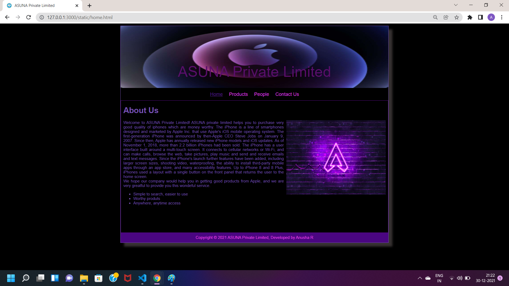
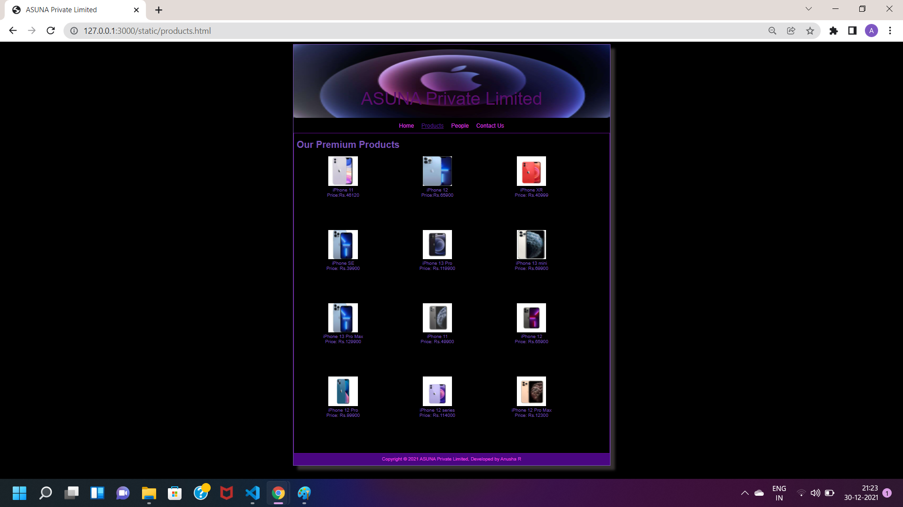
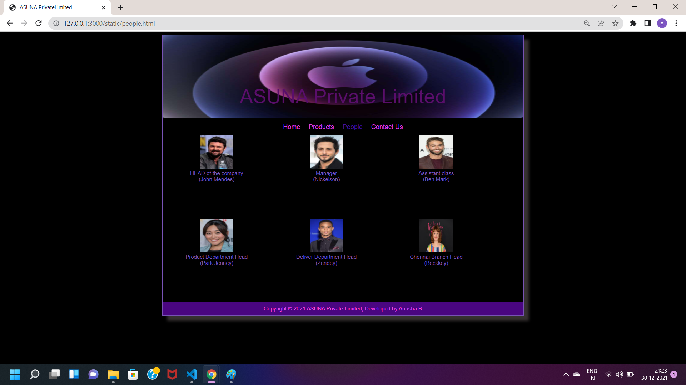
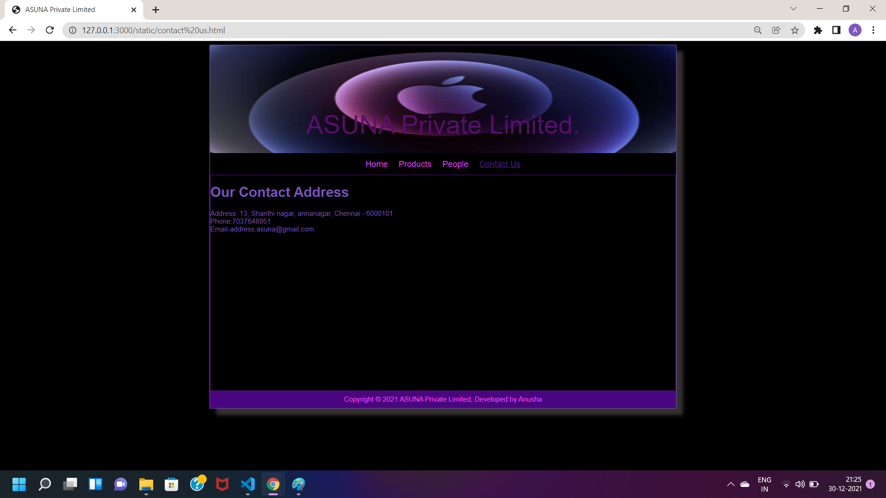

# Web Design for a Software Product Company

## AIM:

To design a static website for a software product company company.

## DESIGN STEPS:

### Step 1:

Requirement collection.

### Step 2:

Creating the layout using HTML and CSS.

### Step 3:

Updating the sample content.

### Step 4:

Choose the appropriate style and color scheme.

### Step 5:

Validate the layout in various browsers.

### Step 6:

Validate the HTML code.

### Step 6:

Publish the website in the given URL.

## PROGRAM :
HOME PAGE.HTML:
~~~
<!DOCTYPE html>
<html lang="en">
  <head>
    <title>ASUNA Private Limited</title>
    <link rel="stylesheet" href="./css/layout.css" />
    <link rel="icon" href="./img/icon.png" type="image/x-icon" />
  </head>

  <body>
    

      
ASUNA Private Limited 

      

        
<a href="/static/home.html">Home</a>

        
<a href="/static/products.html">Products</a>

        
<a href="/static/People.html">People</a>

        
<a href="/static/contact us.html">Contact Us</a>

      

      

        

          <h1>About Us</h1>
          
          

            Welcome to ASUNA Private Limited!
            ASUNA private limited helps you to purchase very good quality of iphones which are money worthy.
            The iPhone is a line of smartphones designed and marketed by Apple Inc. that use Apple's iOS mobile operating system. 
            The first-generation iPhone was announced by then-Apple CEO Steve Jobs on January 9, 2007. 
            Since then, Apple has annually released new iPhone models and iOS updates. 
            As of November 1, 2018, more than 2.2 billion iPhones had been sold.

            The iPhone has a user interface built around a multi-touch screen. 
            It connects to cellular networks or Wi-Fi, and can make calls, browse the web, take pictures, play music and 
            send and receive emails and text messages. Since the iPhone's launch further features have been added, including larger 
            screen sizes, shooting video, waterproofing, the ability to install third-party mobile apps through an app store, 
            and many accessibility features. Up to iPhone 8 and 8 Plus, iPhones used a layout with a single button on the front panel 
            that returns the user to the home screen.
             
            We hope our company would help you in getting good products from Apple, 
            and we are very greatful to provide you this wondeful service.
            <ul>
              <li>Simple to search, easier to use</li>
              <li>Worthy produts</li>
              <li>Anywhere, anytime access</li> 
            </ul>
          

        

      

      

        Copyright &#169; 2021 ASUNA Private Limited, Developed by Anusha R
      

    

  </body>
</html>
~~~
PRODUCT>HTML:
~~~
<!DOCTYPE html>
<html lang="en">
  <head>
    <title>ASUNA Private  Limited</title>
    <link rel="stylesheet" href="./css/layout.css" />
    <link rel="icon" href="./img/icon2.png" type="image/x-icon" />
  </head>

  <body>
    

      
ASUNA Private Limited

      

        
<a href="/static/home.html">Home</a>

        
<a href="/static/products.html">Products</a>
  
        
<a href="/static/people.html">People</a>

        
<a href="/static/contact us.html">Contact Us</a>

      

      

        
    
          <h1>Our Premium Products</h1>
          

              
 
                  

                  
                  

                  
iPhone 11

                  
Price:Rs.46120

              

              
 
                  

                  
                  

                  
iPhone 12

                  
Price:Rs.65900

              

              
 
                  

                  
                  

                  
iPhone XR

                  
Price: Rs.40999

              

              
 
                

                
                

                
iPhone SE

                
Price: Rs.39900 

            

            
 
              

              
              

              
iPhone 13 Pro

              
Price: Rs.119900

          

          
 
            

            
            

            
iPhone 13 mini

            
Price: Rs.69900

        

        
 
          

          
          

          
iPhone 13 Pro Max

          
Price: Rs.129900

      

      
 
        

        
        

        
iPhone 11

        
Price: Rs.49900

    

    
 
      

      
      

      
iPhone 12

      
Price: Rs.65900

    

    
 
       

       
       

       
iPhone 12 Pro

       
Price: Rs.99900 

    

    
 
      

      
    

       
iPhone 12 series

       
Price: Rs.114000

    

    
 
      

      
     

        
iPhone 12 Pro Max

        
Price: Rs.12300

      

    

  
        
  

    

      Copyright &#169; 2021 ASUNA Private Limited, Developed by Anusha R
    

  

 </body>
</html>
~~~
CONTACT.HTML:
~~~
<!DOCTYPE html>
<html lang="en">
  <head>
    <title>ASUNA Private Limited</title>
    <link rel="stylesheet" href="./css/layout.css" />
    <link rel="icon" href="./img/globee.png" type="image/x-icon" />
  </head>
  
  <body>
    

      
ASUNA Private Limited.

      

        
<a href="/static/home.html">Home</a>

        
<a href="/static/products.html">Products</a>
  
        
<a href="/static/people.html">People</a>

        
<a href="/static/contact us.html">Contact Us</a>

      

      
        

           <h1>Our Contact Address</h1>  
        
          

           Address: 13, Shanthi nagar, annanagar, Chennai - 6000101
            Phone:7037648951
            Email-address:asuna@gmail.com
          

        

     

  Copyright &#169; 2021 ASUNA Private Limited, Developed by Anusha 

</body>
</html>
~~~
PEOPLE.HTML:
~~~
<!DOCTYPE html>
<html lang="en">
  <head>
    <title>ASUNA PrivateLimited</title>
    <link rel="stylesheet" href="./css/layout.css" />
    <link rel="icon" href="./img/icon2.png" type="image/x-icon" />
  </head>

  <body>
    

      
ASUNA Private Limited

      

        
<a href="/static/home.html">Home</a>

        
<a href="/static/products.html">Products</a>
  
        
People</a>

        
<a href="/static/contact us.html">Contact Us</a>

      

      
 
        

        
      

         
HEAD of the company
            
           (John Mendes)
         

      

      
 
        

        
      

         
Manager
            
           (Nickelson)
         

      

      
 
        

        
      

         
Assistant class  (Ben Mark)

      

      
 
        

        
      

         
Product Department Head   (Park Jenney)

      

      
 
        

        
      

         
Deliver Department Head   (Zendey)

      

      
 
        

        
      

         
Chennai Branch Head   (Beckkey)

      

      

        Copyright &#169; 2021 ASUNA Private Limited, Developed by Anusha R
      

    

  </body>
  </html>
  ~~~
  LAYOUT.CSS:
  ~~~
  * {
  box-sizing: border-box;
  font-family: Arial, Helvetica, sans-serif;
}
body {
  background-color: rgb(0, 0, 0);
  color: #7953b6;
}
.container {
  width: 1080px;
  margin-left: auto;
  margin-right: auto;
  border-width: 1px 1px 1px 1px;
  border-style: solid;
  box-shadow: 15px 15px 8px rgb(54, 49, 49);
}

.banner {
  display: block;
  width: 100%;
  height: 250px;
  text-align: center;
  font-size: 60px;
  background-image: url("/static/img/S5.jpg");
  background-size: 100% 100%;
  margin: 0px 0px 0px 0px;
  padding-top: 150px;
  color: #850ba3;
}

.menu {
  display: block;
  width: 100%;
  height: 50px;
  font-size: larger;
  background-color: #000000;
  text-align: center;
  padding-top: 15px;
  margin: 0px 0px 0px 0px;
  border-width: 1px;
}

.menuitem {
  display: inline-block;
  margin-left: 10px;
  margin-right: 10px;
}
.menuitemselected {
  display: inline-block;
  margin-left: 10px;
  margin-right: 10px;
  color: #420fa0;
}

.menuitem a {
  text-decoration: none;
  color: #de3fe4;
}

.content {
  display: block;
  width: 100%;
  background-color: #000000;
  min-height: 500px;
  margin: 0px 0px 0px 0px;
  border-width: 1px;
  border-color: rgb(96, 11, 145);
  border-style: solid;
}
.homecontent {
  min-height: 500px;
  margin: 10px 10px 10px 10px;
}
.homecontent h1 {
  text-align: left;
}
.homecontent img {
  float: right;
  width: 400px;
  height: 300px;
  margin-left: 10px;
}

.contenttext {
  text-align: justify;
}

.productcontent {
  min-height: 500px;
  margin: 10px 10px 10px 10px;
}

.productcontent h1 {
  text-align: left;
}

.productitems {
  display: block;
}

.productitem {
  display: inline-block;
  width: 30%;
  height: 250px;
  text-align: center;
}

.productitem img {
  width: 100px;
  height: 100px;
  display: block;
}
.productitem .itemimage {
  display: block;
  margin-left: auto;
  margin-right: auto;
  width: 100px;
  margin-bottom: 5px;
}

.productitem .itemname {
  display: block;
}
.productitem .itemprice {
  display: block;
}

.footer {
  display: block;
  width: 100%;
  height: 40px;
  background-color: #4a0681;
  text-align: center;
  padding-top: 10px;
  margin: 0px 0px 0px 0px;
  color: #f34deb;
}
~~~
## OUTPUT:

## Result:

Thus a website is designed for the software product company and the HTML,CSS code are validated.
